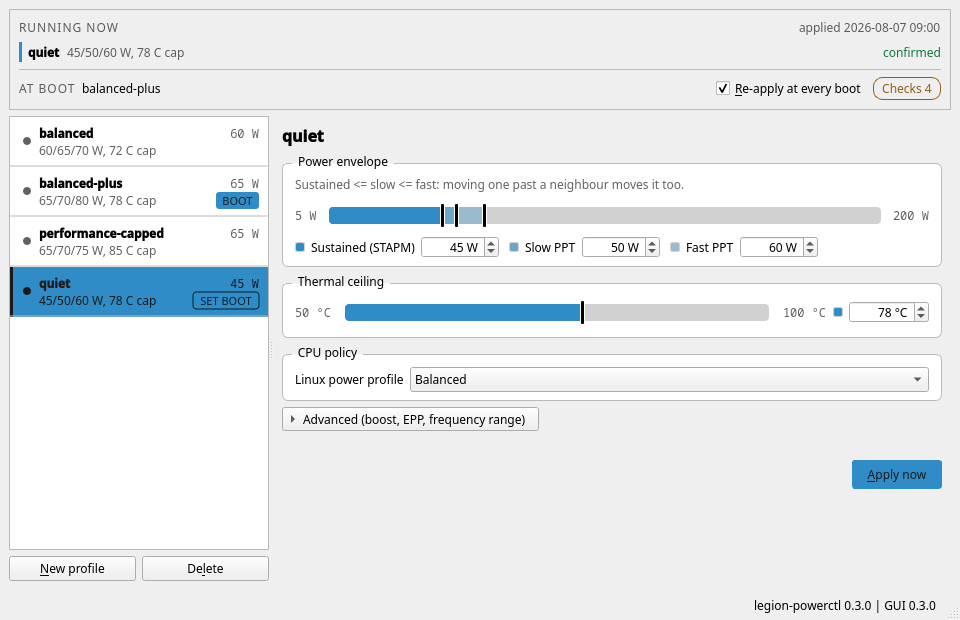

# legion-powerctl

[](https://github.com/alex-macra/ryzen-legion-powerctl/actions/workflows/ci.yml)
[](LICENSE)

Configurable AMD Ryzen CPU power and thermal limits for Lenovo Legion laptops on Arch Linux and CachyOS. It wraps [RyzenAdj](https://github.com/FlyGoat/RyzenAdj).

> RyzenAdj writes low-level CPU power-management values. Support varies by CPU family, firmware, kernel and laptop model, and on an unsupported family a write can hang or lock the machine. Start conservatively, preview with `--dry-run`, test stability before enabling boot persistence, and watch temperatures. If a profile destabilizes your machine, see [Recovery](docs/TROUBLESHOOTING.md#recovery-the-machine-is-unstable-after-applying-a-profile).
>
> Legion is a trademark of Lenovo Group Ltd., used here descriptively. This project is not affiliated with, endorsed by, or supported by Lenovo, AMD, CachyOS, or the RyzenAdj project.



The screenshot is captured from the running application offscreen and driven by test fixtures, so it can be regenerated on any machine and cannot go stale.

## Install

```bash
git clone https://github.com/alex-macra/ryzen-legion-powerctl.git
cd ryzen-legion-powerctl
./install.sh --install-ryzenadj --no-enable
```

On Arch and CachyOS this builds a pacman package, so every file is package-owned. `--no-enable` leaves boot persistence off until you have tested a profile. See [docs/INSTALL.md](docs/INSTALL.md) for the manual path, other distributions, updating and uninstalling.

## Use

```bash
legion-powerctl doctor                              # compatibility checks
sudo legion-powerctl apply balanced-plus --dry-run  # preview, write nothing
sudo legion-powerctl apply balanced-plus            # apply once
sudo legion-powerctl enable                         # and at every boot
legion-powerctl status                              # what is running now
legion-powerctl-gui                                 # optional Qt control panel
```

`status --json` is schema-versioned machine-readable state and `status --waybar` emits what a Waybar custom module expects.

## What it controls

- The STAPM sustained package-power limit, the slow and fast PPT limits, and the Tctl temperature ceiling
- Optionally the `powerprofilesctl` policy, the CPUFreq range, CPU boost, and the AMD P-State EPP preference
- Boot persistence, as a single systemd one-shot with no daemon and no timer

It does not undervolt, raise GPU or NVIDIA wattage, flash a VBIOS, write Lenovo EC fan tables, or poll in the background.

## Profiles

Profiles are plain `KEY=VALUE` files in `/etc/legion-powerctl/profiles.d/`, parsed as data and never sourced. Four ship as starting examples, not as recommendations:

| Profile | STAPM / Slow / Fast | Ceiling | Intent |
|---|---:|---:|---|
| `balanced` | 60 / 65 / 70 W | 72 °C | Silent daily driver: boost off, quiet fan curve, full base-clock throughput |
| `balanced-plus` | 65 / 70 / 80 W | 78 °C | Boost on with moderate power; near performance-capped speed at lower noise |
| `quiet` | 45 / 50 / 60 W | 78 °C | Cooler and quieter for light work |
| `performance-capped` | 65 / 70 / 75 W | 85 °C | Sustained performance under a firm cap |

Validation accepts 5-200 W and 50-100 °C and requires `STAPM_W <= SLOW_W <= FAST_W`. Those are sanity bounds, not a safe range: 200 W is far outside any Legion's power delivery. Stay at or below your machine's stock envelope unless you know exactly why you are not. [docs/PROFILES.md](docs/PROFILES.md) documents every field and a before/after tuning method.

## Requirements

- An Arch-based distribution with systemd and Bash 5
- An AMD Ryzen processor supported by RyzenAdj
- `ryzenadj` **0.19.0 or newer** from the AUR, the first release with Fire Range/HX support
- Optional: `powerprofilesctl`; `pyside6` and `polkit` for the GUI; Python 3 for the GUI launcher

The profiles were developed on one Lenovo Legion Pro 7 with a Ryzen 9 9955HX3D, and those observations are informal rather than benchmarks. Automated verification is headless: the GUI has been exercised only offscreen, the polkit prompts have never been displayed, and the built package has not been installed on a real Arch system. Compatibility reports from other AMD Legion models are the most useful contribution right now.

## Documentation

| | |
|---|---|
| [Why this exists](docs/WHY.md) | The problem the shipped profiles were built for, and why RyzenAdj rather than the kernel's newer interfaces |
| [Installing](docs/INSTALL.md) | Manual builds, other distributions, boot persistence, updating, uninstalling |
| [Profiles](docs/PROFILES.md) | Every profile field, and how to tune one against a real workload |
| [Troubleshooting](docs/TROUBLESHOOTING.md) | Keyed by the error you actually see, starting with recovery |
| [Architecture](docs/ARCHITECTURE.md) | How the CLI, the GUI and the boot service fit together |
| [Interface](docs/UI.md) | Why Qt Widgets, how the window is laid out, and the accessibility account |
| [Comparison](docs/COMPARISON.md) | How this differs from LenovoLegionLinux, CoreCtrl, TLP and others |

Read [CONTRIBUTING.md](CONTRIBUTING.md) before opening an issue or pull request, and report vulnerabilities privately as described in [SECURITY.md](SECURITY.md).

## License

Copyright 2026 Alex Macra. legion-powerctl is [MIT](LICENSE) licensed. RyzenAdj is a separate project under its own licence.
