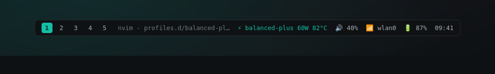

# Installing

Run the installer as your normal user, not through `sudo`:

```bash
./install.sh --install-ryzenadj --no-enable
```

Installation works from a `git clone`, a release tarball, or GitHub's **Download ZIP**;
only the clone step itself needs git.

On Arch and CachyOS it builds a pacman package with `makepkg` and installs it, so every
file is pacman-owned. It also pulls in the GUI runtime (`pyside6`, `polkit`) so the
control panel works out of the box; pass `--no-gui` for a headless machine. On a fresh
install, `--no-enable` leaves the boot service disabled until a profile has been tested.
It does not disable a service left enabled by an older installation.

## Building it by hand

`ryzenadj` lives in the AUR, so a plain `makepkg -si` cannot resolve it and it must be
installed first:

```bash
paru -S ryzenadj   # AUR dependency; also replaces the stale ryzenadj-git
make dist
cp dist/legion-powerctl-*.tar.gz packaging/arch/
cd packaging/arch && makepkg -si
```

Then check compatibility and preview a profile before writing anything:

```bash
legion-powerctl doctor
sudo legion-powerctl apply balanced-plus --dry-run
```

## Other distributions

Script installs on other systemd distributions are experimental and need a working
RyzenAdj installation first. In that path, or with `--script-install`, files are copied
directly and stay untracked by any package manager.

If you used a script install before, pacman will not overwrite those unowned files. The
installer detects them and offers to run `./uninstall.sh` for you first, keeping
`/etc/legion-powerctl`. The prompt defaults to no; `--replace-script-install` answers it
for unattended runs.

For a machine that already has an earlier `legion-balanced-plus.service` created by
hand:

```bash
./install.sh --install-ryzenadj --migrate-legacy --no-enable
```

## Requirements in detail

`make` is needed to install or uninstall, because `./install.sh` and `./uninstall.sh`
read the file list from the Makefile rather than keeping their own copy of it. It is
already present with `base-devel` and is not needed at runtime.

RyzenAdj checks the `ryzen_smu` kernel module under `/sys/kernel/ryzen_smu_drv`
and otherwise tries `/dev/mem`. The module does not create a
`/dev/ryzen_smu_drv` device. RyzenAdj 0.19 requires a compatible driver version
and the module's `smn`, `pm_table_size`, and `pm_table` files before it can apply
limits through the module. If that version is compatible but these files are
missing, RyzenAdj does not fall back to `/dev/mem`. Check the apply output rather
than assuming the command interface means limits were set.

The post-apply confirmation and doctor's `Limits` line read limits back with
`ryzenadj -i`. A successful apply can still report `this apply is unverified`
when its metrics cannot be read. [Fire Range PM-table support is still incomplete](https://github.com/amkillam/ryzen_smu/issues/49).

`./install.sh --install-ryzen-smu` installs it for you: it works out which headers
package matches the running kernel (from `/usr/lib/modules/$(uname -r)/pkgbase`, so
`linux-cachyos-headers` on a CachyOS kernel rather than a generic `linux-headers` that
would not match), builds the AUR package, loads the module, and writes
`/etc/modules-load.d/legion-powerctl.conf` when the running driver version is
compatible and RyzenAdj's required sysfs files exist, so it comes back after a
reboot. If a loaded module is incompatible, the explicit install flag tries an
AUR update; it adds a boot entry only after the running module verifies. If the
old module remains loaded, reboot and rerun the flag to verify and persist the
updated one. A newly loaded unusable module is unloaded again without force;
a module that was already loaded is left for explicit recovery. Use
`sudo legion-powerctl repair balanced-plus` or **Checks > Repair balanced-plus**
to back up and recover a broken installation. The installer respects the
recovery blacklist instead of loading the module again. The module
is optional, so nothing in that path can fail the install - every problem warns and
carries on. Without the flag the installer offers it interactively when the
`/sys/kernel/ryzen_smu_drv` command interface is missing, and stays silent when there is no terminal. With
Secure Boot on you still have to enrol the module's MOK key yourself before it loads.

What blocks the `/dev/mem` fallback is **kernel lockdown**, not Secure Boot directly.
Fedora and Ubuntu kernels tie lockdown to Secure Boot; Arch-family kernels generally do
not, so Secure Boot alone is usually fine on CachyOS. A kernel built with
`CONFIG_STRICT_DEVMEM` restricts the fallback independently, and `iomem=relaxed` on the
kernel command line relaxes that. Where the fallback is unavailable, install
`ryzen_smu-dkms-git`, and enroll its MOK key if Secure Boot is on, since it is an
out-of-tree module. `legion-powerctl doctor` reports the SMU backend, the lockdown
state and Secure Boot separately.

## Boot persistence

The installer enables `legion-powerctl.service` unless `--no-enable` is given:

```ini
[Service]
Type=oneshot
ExecStart=/usr/bin/legion-powerctl apply --boot
RemainAfterExit=yes
```

systemd runs the command once at each boot. `active (exited)` is the expected state: the
command completed and no process remains. To verify it after a reboot, see
[Confirm boot persistence](TROUBLESHOOTING.md#confirm-boot-persistence).

Firmware profile changes, Fn+Q mode changes, AC transitions and suspend or resume can
overwrite SMU settings on some laptops. This project deliberately does not add a timer.
Reapply with `sudo legion-powerctl apply` when required.

Existing `/etc/legion-powerctl` profiles are always preserved: by pacman's `backup=`
handling in the package flow, and by the installer itself in the script flow. The boot
service is enabled through `legion-powerctl enable`, which runs `doctor` first and
refuses on failures. `--force` overrides that.

## The graphical interface

`legion-powerctl-gui` is an optional Qt control panel built on PySide6. It runs
unprivileged and reads state through `legion-powerctl status --json`; privileged actions
go through `pkexec` with the shipped polkit policy, described in
[SECURITY.md](../SECURITY.md). The Bash CLI stays the single source of truth, and every
button maps to a CLI command.

The header separates the two things that are easy to confuse. **Running now** is what was
last written to the hardware, read from the record `apply` leaves in `/run`, with the
watts that actually reached the SMU and whether they were read back and confirmed. **At
boot** is the profile `config.conf` points at, which the boot service applies at the next
start; you set it with the `BOOT` pin on a profile row. They are frequently not the same
profile, and nothing keeps them in step on purpose.

There is one button, **Apply now**, which writes the profile and applies it. `Ctrl+S`
saves without applying. Applying limits higher than what is running asks first; lowering
them does not.

If the GUI does not start:

```bash
sudo pacman -S pyside6 polkit
legion-powerctl-gui
```

`legion-powerctl doctor` has a `GUI` line reporting whether the launcher, PySide6 and the
polkit policy are all present, so you do not have to click the icon to find out. Native
Qt follows your desktop colour scheme; see [UI.md](UI.md).

## Widgets and bars

`status --waybar` emits exactly what a [Waybar](https://github.com/Alexays/Waybar) custom
module expects:

```jsonc
"custom/legion": {
    "exec": "legion-powerctl status --waybar",
    "return-type": "json",
    "interval": 30,
    "format": "⚡ {}",
    "on-click": "legion-powerctl-gui"
}
```



*Design mockup, not a screenshot of a running bar.*

`text` carries the label shown above (profile name, sustained watts, temperature ceiling),
`tooltip` the full envelope, and `alt` and `class` the bare profile name so CSS rules can
key on it.

## Updating

Pull a newer checkout and rerun `./install.sh`. On Arch and CachyOS the rebuilt package
upgrades the previous one through pacman, and edited profiles in `/etc/legion-powerctl`
are preserved as `.pacnew` candidates. Script installs preserve existing profiles unless
`--force-config` is supplied.

Pulling Git changes updates the checkout only. Reinstall and close every running GUI
window before launching the app again. To distinguish the checkout from the installed
CLI, compare:

```bash
./bin/legion-powerctl version
/usr/bin/legion-powerctl version
legion-powerctl version
```

For this update, all three should report `0.4.0`, and the reopened GUI header should
show `legion-powerctl 0.4.0 | GUI 0.4.0`. If the last command differs from
`/usr/bin/legion-powerctl`, use `type -a legion-powerctl` to locate the older copy
on your PATH. On Arch/CachyOS, `pacman -Q legion-powerctl` should report `0.4.0-1`.
Upgrading preserves edited profiles; use **Checks > Repair balanced-plus** to apply
the 60/65/75 W, 78 C recovery baseline if the old settings still need repair.

To try changes in your local checkout without pushing to GitHub or reinstalling,
run `make dev-gui` from that checkout. Close and reopen it after edits; it reads
the GUI and CLI source files directly while using the installed profiles. Privileged
edits may use a generic `pkexec` prompt because the installed polkit policy names
`/usr/bin/legion-powerctl`. This preview does not replace the installed desktop
launcher. A local commit is enough for a package rebuild with `./install.sh`;
`make dist` archives local `HEAD`, so uncommitted edits are not packaged.

## Uninstalling

Package install:

```bash
sudo pacman -R legion-powerctl
```

Edited configuration under `/etc/legion-powerctl` is kept as `.pacsave` files. Script
install:

```bash
./uninstall.sh          # keeps /etc/legion-powerctl
./uninstall.sh --purge  # removes profiles and configuration too
```

RyzenAdj is not removed automatically, because other tools may depend on it.
The recovery blacklist at `/etc/modprobe.d/legion-powerctl-no-ryzen-smu.conf`
and backups under `/var/lib/legion-powerctl/backups` are also retained. Remove
that blacklist only if you intend to restore the optional module's automatic
loading; see [recovery rollback](TROUBLESHOOTING.md#recover-balanced-plus).
